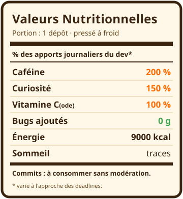

<!-- =======================================================================
     PROFIL GITHUB DE @Lejusdefruits  🍊
     Structure du dépôt (à respecter) :
       Lejusdefruits/                <- dépôt nommé EXACTEMENT comme ton pseudo
        ├─ README.md                 <- ce fichier
        ├─ assets/
        │   ├─ header-light.svg
        │   ├─ header-dark.svg
        │   └─ nutrition.svg
        └─ .github/workflows/
            ├─ snake.yml
            └─ profile-3d.yml
======================================================================= -->

<!-- ====================  HEADER ANIMÉ (change selon thème clair/sombre)  ==================== -->
<picture>
  <source media="(prefers-color-scheme: dark)" srcset="./assets/header-dark.svg">
  <source media="(prefers-color-scheme: light)" srcset="./assets/header-light.svg">
  
</picture>

<!-- ====================  TEXTE QUI SE TAPE TOUT SEUL  ==================== -->
<div align="center">

[](https://github.com/Lejusdefruits)


</div>

---

## 🧃 La recette maison

> Mon smoothie technique du moment — remplace les ingrédients par **tes** vraies technos.

```
🥤 SMOOTHIE "FULL STACK"  ·  pour 1 développeur

   2 doses ......... Python
   1 rasade ........ JavaScript / TypeScript
   1 poignée ....... React
   1 zeste ......... Docker
   à volonté ....... Git

   Bien mélanger. Servir frais. Ne contient aucun bug ajouté.
```

<!-- Remplace la liste i=... par tes technos : https://skillicons.dev -->
<div align="center">

[](https://skillicons.dev)

</div>

---

## 🏷️ Étiquette du produit

<table>
<tr>
<td width="45%" valign="top">



</td>
<td valign="top">

### À propos de ce jus

- 🍊 **Pressé à** : ta ville / ton pays
- 🎓 **Origine** : ta formation / ton parcours
- 🌱 **En train de mûrir** : ce que tu apprends en ce moment
- 🤝 **Se marie bien avec** : la collaboration, les projets open-source
- 📫 **Pour passer commande** : ton email / LinkedIn

> *« On reconnaît un bon jus à sa régularité. »*

</td>
</tr>
</table>

---

## 📊 Les chiffres du pressoir

<div align="center">


<br>


<br><br>


</div>

---

## 🐍 Le serpent qui boit tout le jus

<!-- Généré automatiquement par .github/workflows/snake.yml -->
<div align="center">

<picture>
  <source media="(prefers-color-scheme: dark)" srcset="https://raw.githubusercontent.com/Lejusdefruits/Lejusdefruits/output/snake/snake-dark.svg">
  <source media="(prefers-color-scheme: light)" srcset="https://raw.githubusercontent.com/Lejusdefruits/Lejusdefruits/output/snake/snake.svg">
  
</picture>

</div>

---

## 🏙️ Mes contributions en relief

<!-- Généré automatiquement par .github/workflows/profile-3d.yml -->
<div align="center">


</div>

<div align="center">
<sub>🍹 Pressé maison avec beaucoup de café — merci d'être passé !</sub>
</div>
